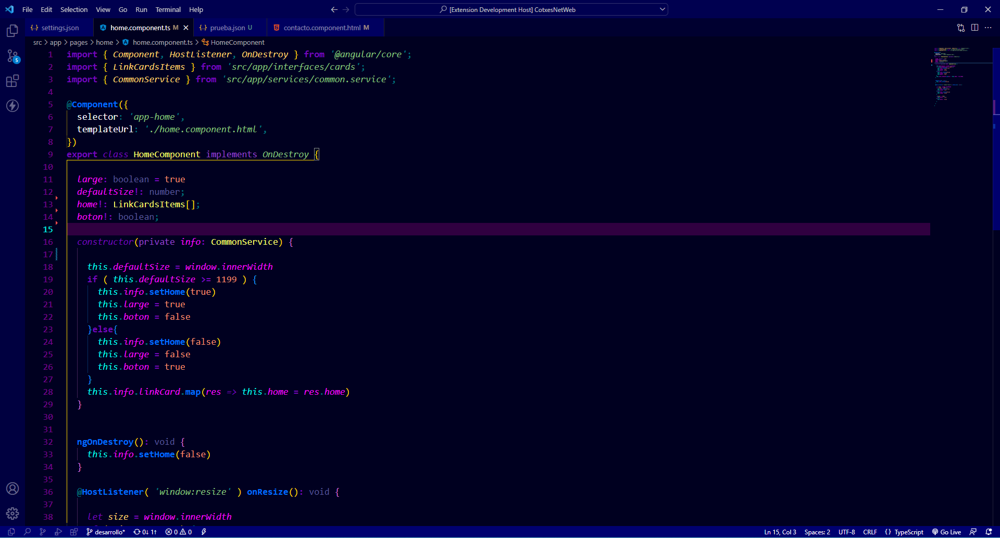
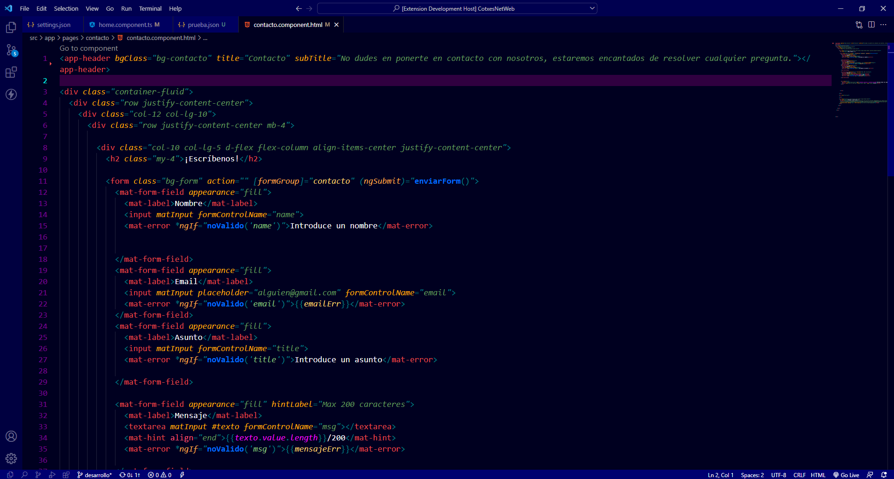
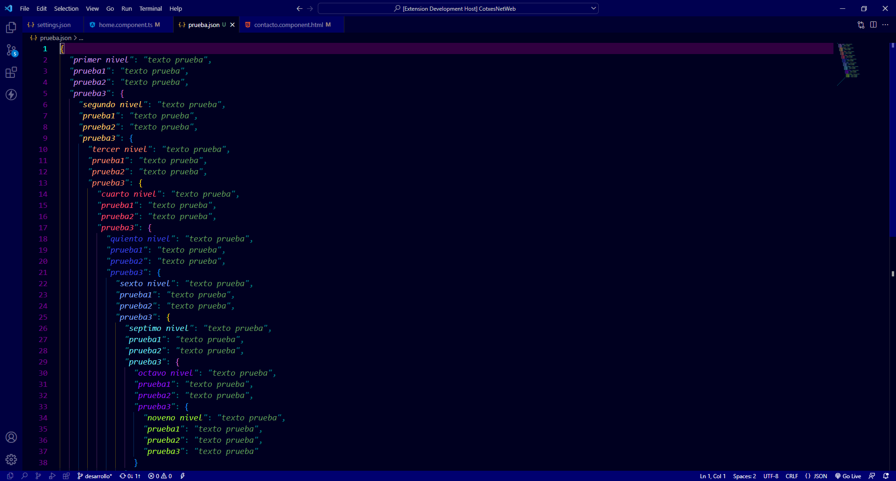

Tema Chulo
===
Este tema ha sido diseñado para separar por colores los distintos tipos de datos recibidos y creados para facilitar la lectura del código.

## Typescript
- Variables : `rosa`
- Funciones : `azul`
- Clases    : `amarillo`
- Meta-datos: `violeta`
- Tags      : `rojo`
- Atributos : `naranja`

## HTML
- Tags      : `rojo`
- Atributos : `naranja`

## JSON
Tienes colores hasta 9 niveles!

